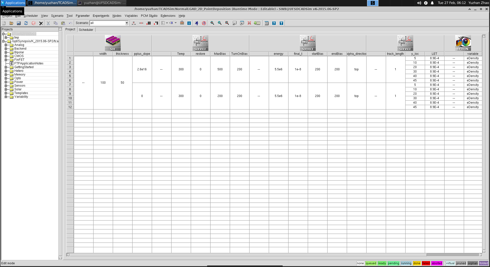

# Introduction.

This is a TCAD example of conventional LGAD with (point-like) charge injection.


## To begin

To start the `SWB` project:

```
git clone https://github.com/neko-0/NormalLGAD_2D_PointDeposition.git
swb NormalLGAD_2D_PointDeposition
```

## Quick explaination

### Creating structure

After opening the `SWB`, you should be able to see the following:



To start the geometry creation, `right-click` one of the node in the last column of the `sentaurus structure editor (SDE)` tool and click `run` option.

After it finish sucessfully, the node will turn `yellow`.
To view the structure, `right-click` and select `Visulaize->Sentaurus Visual(Select File...)`. The `nXXXX_LGAD_msh.tdr` is the structure that contains doping, meshing, etc.

### Electrical simulation

The second tool `SDEVICE` is to perform electrical simulation (bias voltage ramping) and `I-V` curve can be generated from this tool.

Each of the voltage step is also saved for later used in charge simulation.

### Charge simulation

The third tool `SDEVICE` is for alpha-particle simulation, and the forth tool `SDEViCE` is for mip (or point-like) charge injection.


### Plotting with SVisual

Usually all plotting can be done pretty easily by hands. However, if you want a scripting way to do it, you will need to use the `SVisual` tool.

